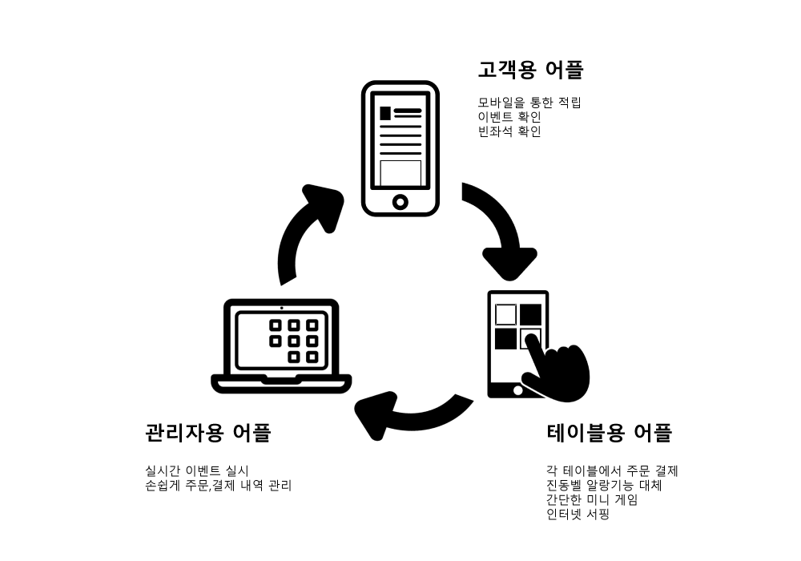

 Hong Seong Hak

Email: hongdroid.ai@gmail.com
 Git-Hub: https://github.com/hong-sh

------------------------------------------------------------------------------------------------

### Education
* 2018.08, 서울시립대학교 전자전기컴퓨터공학과 Artificial Intelligence Lab 석사 졸업 
* 2016.08, 충북대학교 소프트웨어학과 Computer Graphic and Contents Lab 학사 졸업 
                                    
### Interest
* Multi Agent System
* Intelligent Robotics
* Reinforcement Learning
* Mobile Application      
                                                
### Programming Skills  
* Java 
* Android 
* Python
* C / C++
* PHP, MySql         
                                                      
### Awards 
* 2017 강원 공공데이터 창업 모바일 앱 공모전 우수상 수상 
* 2016 전남 모바일 앱 공모전 우수상 수상
* 2015 소상공인 재능기부 챌린지 우수상 수상 
* 2015 충청 아이디어 빅리그 우수상 수상 
* 2014 충북도청 모바일 앱 공모전 장려상 수상       
                                                
### Experience 
* 리얼타임비쥬얼 기술연구소 연구원(전문연구요원), 2018.07 ~ 현재 
* 서울시립대학교 전자전기컴퓨터공학과 Artificial Intelligence Lab 참여 연구원, 2016.08 ~ 2018.07
* 한국 전자통신 연구원 Mobile Contents Lab 하계 인턴쉽, 2015.06 ~ 2015.08 
* 충북대학교 소프트웨어학과 Computer Graphics and Contents Lab 학부 연구원, 2013.08 ~ 2016.02             
                                                                  
### Activity 
* 삼성 소프트웨어 프랜드쉽 동아리 4기 활동, 2015.05 ~ 2016.02 
* 충북대학교 LINC 창업 동아리 활동, 2015.03 ~ 2016.02 
* 충북대학교 소프트웨어학과 학술동아리 ‘CGAC’ 회장, 2014.03 ~ 2015.12 
* Start-Up 헤븐리아이디어 ‘단골택시’ 개발 참여, 2014.05 ~ 2014.08                   
                                                      
### Language 
* ETS 주관 TOEIC 어학시험 830점, 2018.02.11                   
                                    
### Publications 
* Seonghak Hong, Byunggi Choi, Jaeho Lee, “Ontology-based Service Model for Social Robot Service Description”, 2017 ICSR Workshop on Social Robot Intelligence for Social Human-Robot Interaction of Service Robots, Nov.2017                         
            
------------------------------------------------------------------------------------------------                                     

### Projects          
* 개인 서비스용 로봇을 위한 지능형 프레임워크 개발 
  - 서울시립대학교 Artificial Intelligence Lab 참여 과제, 2016.08 ~ 2018.07     
  - Overview         
  개인 서비스용 로봇의 각 기능을 담당하는 하드웨어/소프트웨어 모듈을 통합하고 제어하기 위한 프레임워크 개발
          
  - Contribution          
에이전트 간 통합 프레임워크 및 통신체계 구축                                    
실시간으로 로봇의 작업 상태, 현재 상황, 활용되는 지식 등을 모니터 하기 위한 로그 인터페이스 개발          
               
  - Framework Architecture & Log interface Architecture         

               
  - Used Skills        
\#Java #ActiveMQ            
                       
                       
#### 온톨로지 기반 소셜 로봇 서비스 서술 언어 설계 
* 서울시립대학교 Artificial Intelligence Lab 참여 과제, 2017.02 ~ 2018.07
* Overview                                                                                                 
소셜 로봇 서비스 저작을 위한 서술 언어 및 지식 정의                    

* Contribution          
Role 기반 소셜 서비스 언어 정의 및 지식 모델 구축             

* Ontology-based Description Language Schema and Expression Method Example		
 
               
* Used Skills                        
\#Ontology #RDF 
                       
                                              
#### 유사도 기반 베이비시터 매칭 서비스 개발 
* 2017 강원 데이터 창업 앱 개발 공모전 우수상 수상작, 2017.09 ~ 2017.12 
* Overview                           
양육 유사도 기반 베이비시터 매칭 서비스 개발               
                       
* Contribution          
Google Fire Base를 이용한 온라인 채팅 기능 구현                                                                                                                                            
데이터 베이스 및 서버 기능 개발                

* Service Architecture and Application UI		
		
		
* Used Skills #Android
\#Google Fire Base #PHP #MySql
                       
                                              
#### 소프트웨어 교육을 위한 코드 분석 및 도식화 어플리케이션 개발 
* IITP 주관 2016 소상공인 재능기부 챌린지 사업 참여, 2016.05 ~ 2016.11 
* Overview                           
프로그래밍 교육 접근성과 이해도를 높이기 위한 코드 분석 및 도식화 프로그램 개발

* Contribution          
코드 분석 서버 개발           
                        
* Application UI 		

                        
* Used Skills                       
\#ANTLR(Compiler-Compiler) 
                       
                                             
#### 의료 기관 정보 제공 어플리케이션 개발 
* 2016 전남 모바일 앱 공모전 우수상 수상작, 2016.09 ~ 2016.11 
* Overview                           
위치 및 공공데이터 기반 의료 기관 정보 제공 서비스 개발

* Contribution          
Android Client 개발                                                                      
데이터 베이스 및 서버 개발

* Application UI 		

                        
* Used Skills                        
\#Android #Google Map API #MySql #PHP 
                       
                                              
#### 비 프랜차이즈 카페를 위한 커피 주문/결제 및 마케팅 플랫폼 개발 
* 2015 소상공인 재능기부 챌린지 우수상 수상작, 2015.05 ~ 2015.11 
* Overview                           
대학교 상권 내 개인 카페를 위한 온라인 주문/결제 및 마케팅 플랫폼 개발

* Contribution          
고객용 어플리케이션의 주문/결제 시스템 및 마케팅 알림 기능 개발          
                        
* System Architecture and User Application UI 		
		
                       
* Used Skills                       
 \#Android #GCM(Google Cloud Message) #Http protocol 
                       
                                              
#### 택배 사칭 범죄 예방을 위한 안심 택배 서비스 설계 
* 2015 충청 아이디어 빅리그 우수상 수상작, 2015.04 ~ 2015.12 
* Overview                           
택배 사칭 범죄 예방을 위한 배송 정보 알림 서비스 및 NFC 기반 운송장 설계

* Contribution          
실시간 배송 현황을 확인할 수 있는 사용자 어플리케이션 개발                                                                             
NFC 태그 기반 운송장 설계            
                        
* System Architecture and User Application UI 		
		
                       
* Used Skills                       
 \#Android #Location-based #NFC  
                       
                       
#### 모바일 상에서 Vector Graphic 기반 2D Image 점 편집 및 곡률 계산 연구 
* 한국전자통신연구원(ETRI) Mobile Contents Lab 참여 과제, 2015.06 ~ 2015.08 
* Overview                           
사용자 감성 표현을 위한 이모티콘 편집 기능 개발

* Contribution          
OpenGL ES를 활용한 다각형 점 편집 데모 구현         
                        
* Used Skills                        
\#Android #OpenGL ES 
                        
                                               
#### 위치 기반 음식점 정보 제공 어플리케이션 개발 
* 2014 충청북도 모바일 앱 공모전 장려상 수상작, 2014.05 ~ 2014.09 
* Overview                           
공공데이터 기반 맛집 정보 제공 및 평가 어플리케이션 개발          

* Contribution          
모바일 어플리케이션 UI 및 Google Map API를 이용한 위치 기반 기능 구현         
                        
* Used Skills                        
\#Android #Google Map API 
                        
                        
#### 콜택시 호출 어플리케이션 개발 
* Start-Up 헤븐리아이디어 ‘단골택시’ 어플리케이션 개발 참여, 2014.05 ~ 2014.08 
* Overview                           
카카오 택시와 같은 사용자 콜택시 호출 플랫폼 개발

* Contribution          
 기사용 어플리케이션 UI/UX 개발 및 Bluetooth 기반 택시 미터기와 어플리케이션 연동 구현 
                        
* Used Skills                                               
\#Android #Bluetooth 

------------------------------------------------------------------------------------------------
