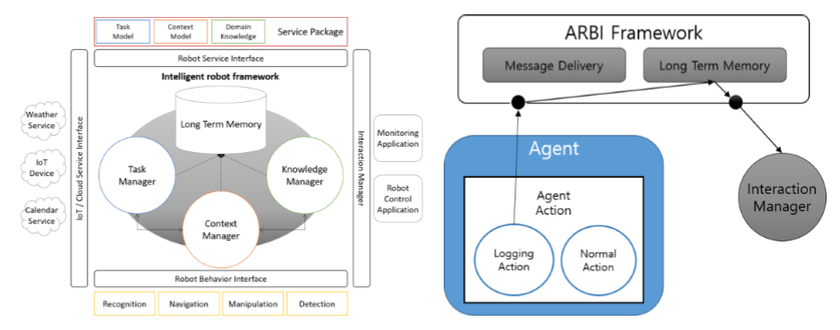

------------------------------------------------------------------------------------------------

### 개인 서비스용 로봇을 위한 지능형 프레임워크 개발 
* 서울시립대학교 Artificial Intelligence Lab 참여 과제, 2016.08 ~ 2018.07     
* 본 프로젝트에서는 개인 서비스용 로봇을 구동하기 위한 하드웨어/소프트웨어 모듈을 통합하고 제어하기 위한 프레임워크를 개발하였습니다.
로봇의 작업 관리나 상황추론을 위한 모듈은 에이전트로 구성되어 black board 기반의 지능형 로봇 프레임워크로 통합됩니다.
저는 에이전트 간 통합 프레임워크와 통신체계를 구축하고 실시간으로 로봇의 작업 상태, 현재 상황, 활용되는 지식 등을 모니터하기 위한 
로그 인터페이스를 개발하였습니다.               
* Framework Architecture & Log interface Architecture         
                
* Used Skills        
\#Java \#ActiveMQ            

### Education
* 2018.08, 서울시립대학교 전자전기컴퓨터공학과 Artificial Intelligence Lab (advisor: 이 재호) 석사 졸업 
* 2016.08, 충북대학교 소프트웨어학과 Computer Graphic and Contents Lab (advisor: 류 관희) 학사 졸업 
                                    
### Interest
* Multi Agent System
* Intelligent Robotics
* Reinforcement Learning
* Mobile Application      
                                                
### Programming Skills  
* Java 
* Android 
* Python
* C / C++
* PHP, MySql         
                                                      
### Awards 
* 2017 강원 공공데이터 창업 모바일 앱 공모전 우수상 수상 
* 2016 전남 모바일 앱 공모전 우수상 수상
* 2015 소상공인 재능기부 챌린지 우수상 수상 
* 2015 충청 아이디어 빅리그 우수상 수상 
* 2014 충북도청 모바일 앱 공모전 장려상 수상       
                                                
### Experience 
* 리얼타임비쥬얼 기술연구소 연구원(전문연구요원), 2018.07 ~ 현재 
* 서울시립대학교 전자전기컴퓨터공학과 Artificial Intelligence Lab 참여 연구원, 2016.08 ~ 2018.07
* 한국 전자통신 연구원 Mobile Contents Lab 하계 인턴쉽, 2015.06 ~ 2015.08 
* 충북대학교 소프트웨어학과 Computer Graphics and Contents Lab 학부 연구원, 2013.08 ~ 2016.02             
                                                                  
### Activity 
* 삼성 소프트웨어 프랜드쉽 동아리 4기 활동, 2015.05 ~ 2016.02 
* 충북대학교 LINC 창업 동아리 활동, 2015.03 ~ 2016.02 
* 충북대학교 소프트웨어학과 학술동아리 ‘CGAC’ 회장, 2014.03 ~ 2015.12 
* Start-Up 헤븐리아이디어 ‘단골택시’ 개발 참여, 2014.05 ~ 2014.08                   
                                                      
### Language 
* ETS 주관 TOEIC 어학시험 830점, 2018.02.11                   
                                    
### Publications 
* Seonghak Hong, Byunggi Choi, Jaeho Lee, “Ontology-based Service Model for Social Robot Service Description”, 2017 ICSR Workshop on Social Robot Intelligence for Social Human-Robot Interaction of Service Robots, Nov.2017                         
                                                
------------------------------------------------------------------------------------------------

  Hey there! This page is included as an example. Feel free to customize it for your own use upon downloading. Carry on!

In the novel, *The Strange Case of Dr. Jeykll and Mr. Hyde*, Mr. Poole is Dr. Jekyll's virtuous and loyal butler. Similarly, Poole is an upstanding and effective butler that helps you build Jekyll themes. It's made by [@mdo](https://twitter.com/mdo).

There are currently two themes built on Poole:

* [Hyde](http://hyde.getpoole.com)
* [Lanyon](http://lanyon.getpoole.com)

Learn more and contribute on [GitHub](https://github.com/poole).

## Setup

Some fun facts about the setup of this project include:

* Built for [Jekyll](http://jekyllrb.com)
* Developed on GitHub and hosted for free on [GitHub Pages](https://pages.github.com)
* Coded with [Sublime Text 2](http://sublimetext.com), an amazing code editor
* Designed and developed while listening to music like [Blood Bros Trilogy](https://soundcloud.com/maddecent/sets/blood-bros-series)

Have questions or suggestions? Feel free to [open an issue on GitHub](https://github.com/poole/issues/new) or [ask me on Twitter](https://twitter.com/mdo).

Thanks for reading!
