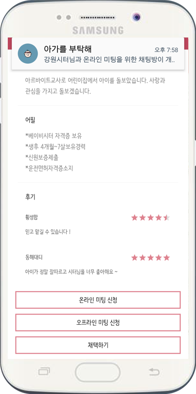

------------------------------------------------------------------------------------------------

### 개인 서비스용 로봇을 위한 지능형 프레임워크 개발 
* 서울시립대학교 Artificial Intelligence Lab 참여 과제, 2016.08 ~ 2018.07     
* 본 프로젝트에서는 개인 서비스용 로봇을 구동하기 위한 하드웨어/소프트웨어 모듈을 통합하고 제어하기 위한 프레임워크를 개발하였습니다.
로봇의 작업 관리나 상황추론을 위한 모듈은 에이전트로 구성되어 black board 기반의 지능형 로봇 프레임워크로 통합됩니다.
저는 에이전트 간 통합 프레임워크와 통신체계를 구축하고 실시간으로 로봇의 작업 상태, 현재 상황, 활용되는 지식 등을 모니터하기 위한 
로그 인터페이스를 개발하였습니다.
               
* Framework Architecture & Log interface Architecture         
                 
               
* Used Skills        
\#Java #ActiveMQ            
                       
                       
### 온톨로지 기반 소셜 로봇 서비스 서술 언어 설계 
* 서울시립대학교 Artificial Intelligence Lab 참여 과제, 2017.02 ~ 2018.07
* 본 프로젝트에서는 사회 내의 조직을 이루어 공동의 목표를 달성하는 소셜 서비스의 서술을 위한 지식 모델을 설계하였습니다.
소셜 서비스는 사회 구성원으로써 주어진 역할을 수행하는 다수의 행위자로 구성되기 때문에, 저는 다수의 행위자에 대한 역할,
상호작용 및 행위에 대한 프로퍼티와 표현방식을 정의하였습니다. 또한 소셜 로봇 서비스 수행 시 추론 기능과 서술 언어에 대한 개방성 및 
확장성을 지원하기 위해 소셜 로봇 서비스 서술 언어 스키마에 대한 온톨로지 기반의 지식 모델을 구축하였습니다. 
               
* Ontology-based Description Language Schema and Expression Method Example		
 
               
* Used Skills                        
\#Ontology #RDF 
                       
                                              
### 유사도 기반 베이비시터 매칭 서비스 개발 
* 2017 강원 데이터 창업 앱 개발 공모전 우수상 수상작, 2017.09 ~ 2017.12 
* 본 프로젝트에서는 부모가 역 경매 방식을 통해 베이비시터에 대한 정보를 비교하고 채택할 수 있는 서비스를 개발하였습니다.
양육 유사도 검사 기능을 통해 부모는 자신과 가장 유사한 양육 성향을 가진 베이비시터를 확인할 수 있습니다. 
추가적으로 부모와 베이비시터 간 원활한 정보 교환을 위해 Google Fire Base를 활용하여 온라인 채팅 기능을 구현하였습니다.  
                       
* Service Architecture and Application UI		
		
     
               
* Used Skills #Android
\#Google Fire Base #PHP #MySql
                       
                                              
### 소프트웨어 교육을 위한 코드 분석 및 도식화 어플리케이션 개발 
* IITP 주관 2016 소상공인 재능기부 챌린지 사업 참여, 2016.05 ~ 2016.11 
* 본 프로젝트에서는 프로그래밍을 처음 배우는 학생의 접근성과 이해도를 높이기 위해 학생이 작성한 코드를 분석하여 데이터 흐름과
순서도를 도식화 하는 어플리케이션을 개발하였습니다. 저는 변수 선언 및 값 할당과 코드 블록을 통해 데이터 흐름과 순서도를 
분석할 수 있는 서버를 개발하였습니다. 또한 분석 결과를 도식화 어플리케이션에 전달하는 기능을 구현하였습니다.
이 어플리케이션을 통해 학생들은 쉽게 논리적 오류를 확인할 수 있습니다. 
                        
* Application UI 		

                        
* Used Skills                       
\#ANTLR(Compiler-Compiler) 
                       
                                             
### 의료 기관 정보 제공 어플리케이션 개발 
* 2016 전남 모바일 앱 공모전 우수상 수상작, 2016.09 ~ 2016.11 
* 본 프로젝트에서는 공공데이터를 기반으로 약국, 의료 기관, 재활 센터 등의 의료 정보를 제공하는 어플리케이션을 개발하였습니다.
Google Map API를 활용하여 사용자는 현재 위치에 대한 의료기관의 이름, 주소, 전화번호, 평점, 리뷰 등의 정보를 확인할 수 있습니다.
추가적으로 시각장애인의 접근성을 위해 Android Talkback 서비스를 이용한 음성 가이드 기능을 구현하였습니다. 
                        
* Application UI 		
  

                        
* Used Skills                        
\#Android #Google Map API #MySql #PHP 
                       
                                              
### 비 프랜차이즈 카페를 위한 커피 주문/결제 및 마케팅 플랫폼 개발 
* 2015 소상공인 재능기부 챌린지 우수상 수상작, 2015.05 ~ 2015.11 
* 본 프로젝트에서는 비 프랜차이즈 카페의 음료 주문/결제 및 마케팅 플랫폼을 구축하였습니다.
이 플랫폼은 카운터용, 테이블용, 고객용 세가지 어플리케이션으로 구성되며,
저는 고객용 어플리케이션 개발을 맡아 사용자가 음료를 주문/결제 했을 때 데이터를 카운터용 어플리케이션으로 전달하는 기능을 개발하였습니다.
추가적으로 카운터 어플리케이션에서 설정한 신메뉴나 이벤트 같은 마케팅 광고를 사용자 어플리케이션에 노출하는 알림 기능을 구현하였습니다. 
                        
* System Architecture and User Application UI 		
		
      
                       
* Used Skills                       
 \#Android #GCM(Google Cloud Message) #Http protocol 
                       
                                              
### 택배 사칭 범죄 예방을 위한 안심 택배 서비스 설계 
*2015 충청 아이디어 빅리그 우수상 수상작, 2015.04 ~ 2015.12 
*본 프로젝트에서는 택배 사칭 범죄 예방을 위한 서비스와 운송장을 설계하였습니다.
저는 실시간 배송 현황을 확인할 수 있는 사용자 어플리케이션을 개발하였습니다.
그리고 택배 기사가 배송지 근처에 접근 시 사용자에게 택배사에서 제공하는 택배 기사의 정보를 알려주는 기능을 구현하였습니다.
추가적으로 기존 운송장의 개인 정보 유출을 막기 위한 택배 기사와 수령인만 정보를 조회할 수 있는 NFC 태그 기반의 운송장을 설계하였습니다. 
                        
* System Architecture and User Application UI 		
		
  
                       
* Used Skills                       
 \#Android #Location-based #NFC  
                       
                       
### 모바일 상에서 Vector Graphic 기반 2D Image 점 편집 및 곡률 계산 연구 
* 한국전자통신연구원(ETRI) Mobile Contents Lab 참여 과제, 2015.06 ~ 2015.08 
* 본 프로젝트에서는 Bezier curve 공식을 대입한 2D 공간상의 점 편집 기술을 구현하였습니다.
또한 OpenGL ES를 활용하여 점 편집을 위한 모바일 어플리케이션 데모를 개발하였습니다. 
                        
* Used Skills                        
\#Android #OpenGL ES 
                        
                                               
### 위치 기반 음식점 정보 제공 어플리케이션 개발 
* 2014 충청북도 모바일 앱 공모전 장려상 수상작, 2014.05 ~ 2014.09 
*본 프로젝트에서는 충북도청에서 선정한 음식점 정보를 사용자 위치 기반으로 제공하고 음식점에 대한 평가와 리뷰를 작성하는 어플리케이션을 개발하였습니다.
 저는 모바일 어플리케이션 UI와 Google Map API를 이용한 위치 기반 기능을 구현하였습니다. 
                        
* Used Skills                        
\#Android #Google Map API 
                        
                        
### 콜택시 호출 어플리케이션 개발 
* Start-Up 헤븐리아이디어 ‘단골택시’ 어플리케이션 개발 참여, 2014.05 ~ 2014.08 
* 본 프로젝트에서는 현재 카카오택시와 같이 사용자가 콜택시를 호출할 수 있는 플랫폼을 개발하였습니다.
저는 기사용 어플리케이션의 UI/UX를 개발하였고 Bluetooth 기반 택시 미터기와 어플리케이션을 연동하는 기능을 구현하였습니다. 
                        
* Used Skills                                               
\#Android #Bluetooth 
                                                                       
------------------------------------------------------------------------------------------------
